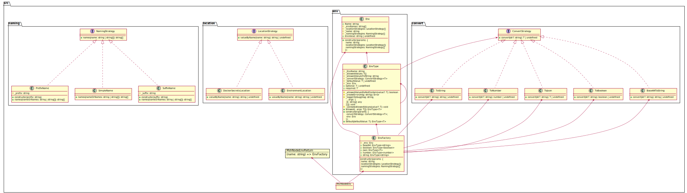

[](https://beecode.semaphoreci.com/projects/msh-node-env)
[](https://codecov.io/gh/beecode-rs/msh-node-env)
[](https://github.com/beecode-rs/msh-node-env/blob/main/LICENSE)  
[](https://nodei.co/npm/@beecode/msh-node-env)

# msh-node-env

Micro-service helper: node environment

This project is intended to be used in typescript project to validate and add types to the project configuration.

<!-- toc -->

- [Install](#install)
- [Usage](#usage)
- [Diagram](#diagram)
- [MshNodeEnv options](#mshnodeenv-options)
- [Location Strategy](#location-strategy)
  * [EnvironmentLocation](#environmentlocation)
  * [DockerSecretsLocation](#dockersecretslocation)
  * [CliArgsMinimistLocation](#cliargsminimistlocation)
- [Naming Strategy](#naming-strategy)
  * [SimpleName](#simplename)
  * [PrefixName](#prefixname)
  * [SuffixName](#suffixname)
- [Logger Strategy](#logger-strategy)

<!-- tocstop -->

## Install

`npm i @beecode/msh-node-env`

## Usage

```typescript
import { MshNodeEnv } from '@beecode/msh-node-env'
import { cacheUtil } from '@beecode/msh-node-util/lib/cache-util'

const env = MshNodeEnv()

export const config = cacheUtil.singleton(() => Object.freeze({
  someRequiredString: env('SOME_REQUIRED_STRING').string.required,
  strWithDefaultValue: env('STR_WITH_DEFAULT_VALUE').string.default('default-value').required,
  optionalString: env('OPTIONAL_STRING').string.optional,
  defKeyName: env('ANY_KEY_NAME').string.required,
  someNumberValue: env('SOME_NUMBER_VALUE').number.required,
  someBooleanValue: env('SOME_BOOLEAN_VALUE').boolean.required,
  someJsonValue: env('SOME_JSON_VALUE').json().required,
}))
```

## Diagram



## MshNodeEnv options

| Name                                     | Default                   | Description                                                                                                                                              |
| ---------------------------------------- | ------------------------- | -------------------------------------------------------------------------------------------------------------------------------------------------------- |
| [locationStrategy](#location-strategy)[] | [ new SimpleEnvLookup() ] | [Optional] Define how are we getting env values. Available: [EnvironmentLocation](#environmentlocation), [DockerSecretsLocation](#dockersecretslocation) |
| [namingStrategy](#naming-strategy)[]     | [ new SimpleName() ]      | [Optional] Define how are we checking for env names. Available: [SimpleName](#simplename), [PrefixName](#prefixname), [SuffixName](#suffixname)          |

## Location Strategy

Location strategy is used to define the way we are getting the variables. We can combine multiple location strategies. The env is
going to look through all chosen locations in the order that they are defined, and it will stop as soon as the env value is found.

### EnvironmentLocation

We are simple checking the process.env for the env name.

`env('SOME_ENV_KEY')` => `process.env.SOME_ENV_KEY`

Usage:
```typescript
import { MshNodeEnv } from '@beecode/msh-node-env'

const env = MshNodeEnv()
```

### DockerSecretsLocation

We are looking in docker swarm secrets.

Usage:

```typescript
import { MshNodeEnv } from '@beecode/msh-node-env'
import { DockerSecretsLocation } from '@beecode/msh-node-env/lib/location/docker-secrets-location'

const env = MshNodeEnv({ locationStrategy: [new location.DockerSecretsLocation()] })
```

### CliArgsMinimistLocation

We can parse predefined command line arguments and use them as configuration. Also we can override environment environment variables

Usage:  
env is going to try and find value in first location strategy, in our example CliArgsMinimistLocation, ad if we find DB_NAME we are going to use it instead from EnvironmentLocation
```typescript
import { MshNodeEnv } from '@beecode/msh-node-env'
import { CliArgsMinimistLocation } from '@beecode/msh-node-env/lib/location/cli-args-minimist-location'
import { EnvironmentLocation } from '@beecode/msh-node-env/lib/location/environment-location'
import { Options } from 'minimist-options'

const options: Options = { DB_NAME: { alias: ['d', 'db-name', 'dbName'], type: 'string' } }
    const env = MshNodeEnv({
      locationStrategies: [new CliArgsMinimistLocation({ options, args: args.slice(2) }), new EnvironmentLocation()],
    })
    const config = Object.freeze({
      dbName: env('DB_NAME').string.required,
      dbPassword: env('DB_PASS').string.required,
    })
```

## Naming Strategy

We are using naming strategy to give us flexibility to introduce isolated env values.  
Idea: If we are using docker-compose and have one .env file with the database credentials that multiple containers.  
Something like:

```dotenv
#.env
DB_USER=user
DB_PASS=pass
DB_NAME=db_name
```

If we wanted to change the database name for just one container, we can use [PrefixName](#prefixname) strategy and create name
isolation, and we can set name of the container as prefix.

```typescript
import { MshNodeEnv } from '@beecode/msh-node-env'
import { PrefixName } from '@beecode/msh-node-env/lib/naming/prefix-name'

const env = MshNodeEnv({ namingStrategy: [new PrefixName('SOME_APP_')] })
```

Then we can add another env value prefixed with that container name.

```dotenv
#.env
DB_USER=user
DB_PASS=pass
DB_NAME=db_name
SOME_APP_DB_NAME=db_different_name
```

### SimpleName

Simple name strategy is just a placeholder, the default strategy. It is not doing anything. :)

### PrefixName

Prefix strategy is adding prefix to the existing name. There are two arguments available (prefix, joinChar).

Usage:

```typescript
import { MshNodeEnv } from '@beecode/msh-node-env'
import { PrefixName } from '@beecode/msh-node-env/lib/naming/prefix-name'

const env = MshNodeEnv({ namingStrategy: [new PrefixName('FOO_'), new PrefixName('BAR_')] })
const test = env('TEST').string.required // env look up in this order 1) BAR_FOO_TEST, 2) FOO_TEST, 3) TEST
```

### SuffixName

Suffix strategy is adding suffix to the existing name. there are two arguments available (suffix, joinChar).

Usage:

```typescript
import { MshNodeEnv } from '@beecode/msh-node-env'
import { SuffixName } from '@beecode/msh-node-env/lib/naming/suffix-name'

const env = MshNodeEnv({ namingStrategy: [new SuffixName('_FOO'), new SuffixName('_BAR')] })
const test = env('TEST').string.required // env look up in this order 1) TEST_FOO_BAR, 2) TEST_FOO, 3) TEST
```

## Logger Strategy

Define how and if we are logging. We are using [@beecode/msh-node-log](https://github.com/beecode-rs/msh-node-log)
For more details read the msh-node-log readme

Usage:

```typescript
import { MshNodeEnv } from '@beecode/msh-node-env'
import { LogLevelType } from '@beecode/msh-node-log'
import { ConsoleLogger } from '@beecode/msh-node-log/lib/console-logger'

NodeEnvLogger(new ConsoleLogger(LogLevel.DEBUG))

const env = MshNodeEnv()
```
